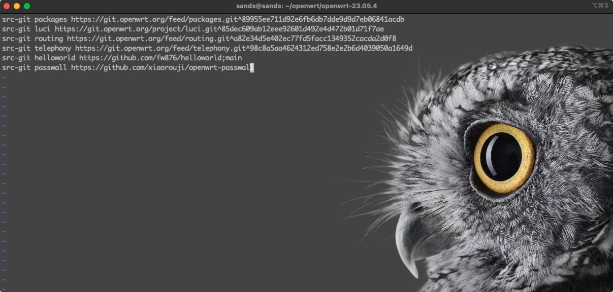
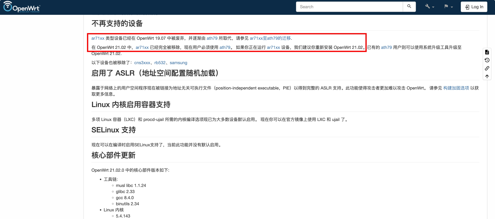
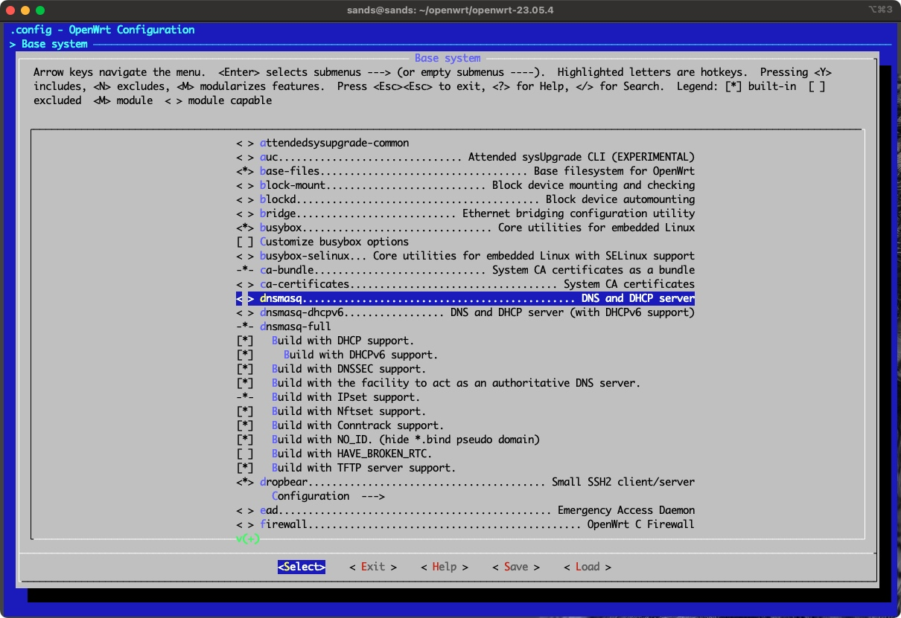
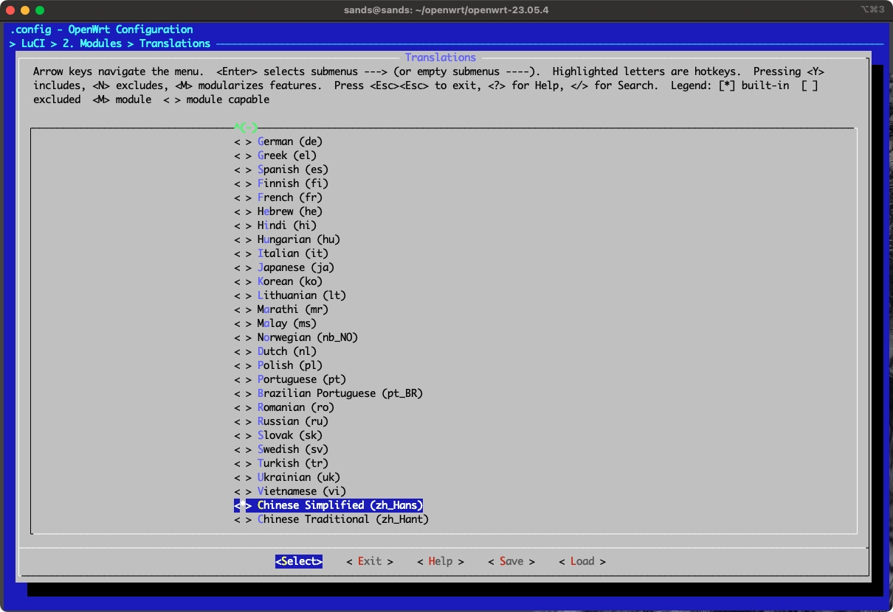
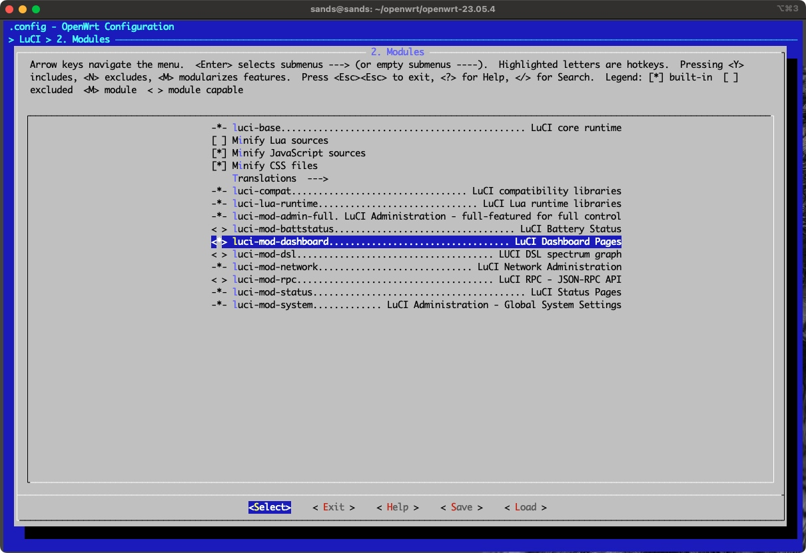
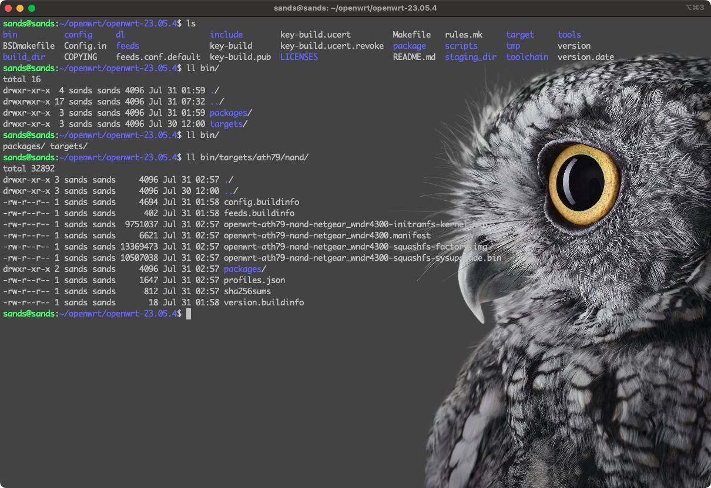

# OpenWrt源码编译记录

## 编译环境

需要使用X86架构的Linux系统编译，推荐使用Ubuntu，版本不限18.x-24.x都可以，安装参考官方网站：[Ubuntu官网](https://ubuntu.com/) ，推荐使用服务器版本，体积小，安装快。

> 建议使用：https://releases.ubuntu.com/18.04.6/ubuntu-18.04.6-live-server-amd64.iso

安装方式自行谷歌，建议在虚拟机中安装。 

***<u>此处强调，安装时不要使用中文语言！不要使用中文语言！！不要使用中文语言！！！</u>***

### 1. 更新Ubuntu软件源

根据国内网络环境，Ubuntu软件源建议更新成国内软件源，比如推荐的有：

* 清华大学开源软件源：https://mirrors.tuna.tsinghua.edu.cn/help/ubuntu/

* 网易163软件源：https://mirrors.163.com/.help/ubuntu.html

* 中国科学技术大学（中科大）开源软件源：https://mirrors.ustc.edu.cn/help/ubuntu.html

设置好软件源后，执行 `sudo apt update` 命令更新。


### 2. 安装依赖包

源码编译的过程中会用到的工具包，下面列出的在Ubuntu不同版本上可能有略微差异，自行谷歌安装就行，个别安装不上的也问题不大。

```shell
sudo apt-get install -y gcc git build-essential libelf-dev subversion libncurses5-dev zlib1g-dev gawk ccache gettext libssl-dev xsltproc wget python tftp python3 python3-distutils pkg-config
```

## 源码编译

先了解一下OpenWRT是干嘛的，[欢迎访问 OpenWrt 项目](https://openwrt.org/zh/start) 。
再说明一下，该编译记录的目的主要是为了针对自己手上的 [网件WNDR4300路由器](https://www.netgear.com/support/product/wndr4300/) 自定义编译出带有 “科学上网” 的OpenWRT固件。

### 1. 获取OpenWRT源码包

在主目录下创建一个openwrt目录，之后操作都在该目录中进行，依次执行如下命令：

```shell
cd ~
mkdir openwrt
cd openwrt/
wget https://github.com/openwrt/openwrt/archive/refs/tags/v23.05.4.tar.gz
```

> 不同版本可以在该页面选择获取：https://github.com/openwrt/openwrt/tags

### 2. 解压缩

将上面下载下来的压缩包解压，进入解压后的文件夹

```shell
tar -zxf v22.03.7.tar.gz
ls
cd openwrt-23.05.4/
```

### 3. 编辑feeds源

feeds源可以理解成OpenWRT系统软件包的安装源，跟Ubuntu的软件源类似，定义了哪些软件源就可以安装对应软件源里的软件包。我们需要的 “科学上网” 软件包默认是不在feeds源里的，所以需要我们手动加上。使用vim编辑 `feeds.conf.default` 文件，在末尾加上：

```shell
src-git helloworld https://github.com/fw876/helloworld;main
src-git passwall https://github.com/xiaorouji/openwrt-passwall
```

编辑完成后文件内容如下图：



### 4. 更新feeds源

更新feeds中指定的所有软件包源，类似于Ubuntu更新软件源一个道理。执行如下命令：

```shell
./scripts/feeds update -a
```

> 注意：更新时需要拉取几个代码仓库，基本都是需要科学上网的，所以要注意自己的网络环境，确保代码拉取成功，更新没有报错。

### 5. 安装所有软件包

更新成功后，执行如下命令：

```shell
./scripts/feeds install -a
```

### 6. 自定义编译选项

上面的更新和安装都成功之后，就可以执行如下命令，自定义编译选项配置了：

```shell
make menuconfig
```

命令执行成功之后如下图：


详细编译配置说明如下：

#### 6.1 Target System 编译目标系统

根据自己的设备型号，在 [OpenWRT支持的硬件设备列表](https://openwrt.org/toh/start) 页面中搜索，如下图：


点击进入自己的设备主页，找到自己设备的CPU类型与Flash类型，如下图：


网件WNDR4300路由器的CPU是Atheros AR9344类型（统称ar系列的），Flash是NAND类型的。

> 需要注意的是，OpenWRT新版本(21.02.x及之后的版本)中已经将ar71xx系列合并到ath79系列中了，详情见：[OpenWrt 21.02.0 - 首个稳定版 - 2021 年 9 月 4 日](https://openwrt.org/zh/releases/21.02/notes-21.02.0#%E4%B8%8D%E5%86%8D%E6%94%AF%E6%8C%81%E7%9A%84%E8%AE%BE%E5%A4%87)



所以这里选择 **Atheros ATH79** 。

#### 6.2 Subtarget 编译目标子类型

根据以上描述，这里选择 `Generic devices with NAND flash` 。

#### 6.3 Target Profile 目标型号

选择自己设备具体的型号就可以了，我这里选择 `NETGEAR WNDR4300` 。

#### 6.4 Base system 基础软件包

这里是自定义OpenWRT系统的基础软件包，这里一般不需要做改动，我们这里只修改一项，去掉 `dnsmasq` ，选上 `dnsmasq-full` ，因为 dnsmasq-full 中包含了所有 dnsmasq 的功能，所以二者选其一即可。



#### 6.5 LuCI 操作界面

LuCI 是OpenWRT系统官方的操作界面，我们想要自定义的软件大部分也都是在LuCI里进行配置。主要是设置中文语言和选上“科学上网”软件包（luci-app-ssr-plus）。

中文语言设置是在 LuCI -> Modules -> Translations 里，如下图：



在 LuCI -> Modules 里，把 luci-mod-dashboard 也选中，操作界面中文更完善一些：




科学上网软件包是在 LuCI -> Applications 里，选上 `luci-app-ssr-plus` ，同时要把 `V2ray-core` 给选上，如下图：


 

其他的就按需选择了，配置好之后选择Save保持配置文件。

### 7. 开始编译

初次编译，建议使用单线程编译，出错了也方便排查，执行下面的命令开始编译，-j后面的数字就是使用几个线程：

```shell
make -j1 V=s
```

编译过程会很漫长，而且过程中会下载一些内部编译依赖，同样也是需要科学上网的网络环境。

### 8. 编译结果

如果一切顺利的话，编译完成后，编译结果会在 `bin` 目录下，固件包是 .img 结尾的文件，升级包为 .bin 结尾的文件，还有一些编译好的软件 .ipk 文件在 packages 目录里，根据需要去使用即可。


34.jpg)
